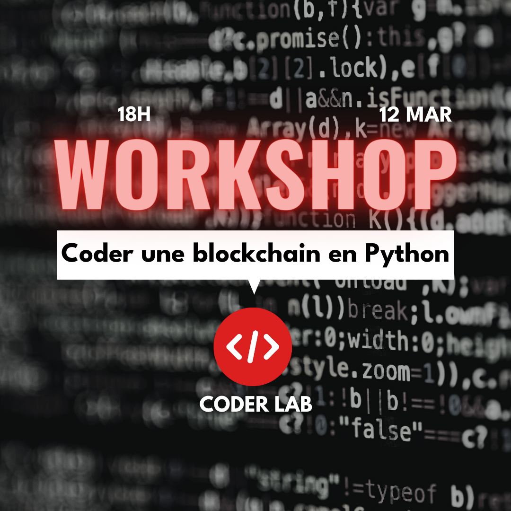

# AutomateCom
> Garage AI Automatisation est un projet qui vise à réaliser plusieurs scripts Python pour automatiser des process internes de l'association. Les garagistes sont plus focus à créer des choses, mais il n'y a pas forcément l'infrastructure qui leur permet de facilement communiquer sur ce qu'ils font et s'organiser entre eux.


## Installation

/!\ A définir /!\

## Usage example

Test Usage : 

> API Generic :
> - GenerateImage : Need image assets as well as text zones for the differents texts. The text zones are where the text will be placed and resized
> (the text in the zone in by default centered)

```py
place_text_on_image(img, text_coord[0], text_coord[1], description, f"{FONTS_DIR}/LeagueSpartan-Bold.ttf","black")
```

Output : 




## Development setup

```py
# Examples Lines
# /!\ A définir /!\
```

## Release History

* 0.0.1
    * Work in progress

## Meta

> Adrian KINSEY - adrian.kinsey@garageisep.com
> 
> Emmanuel TIE - emmanuel.tie@garageisep.com


Distributed under the XYZ license. See ``LICENSE`` for more information.
